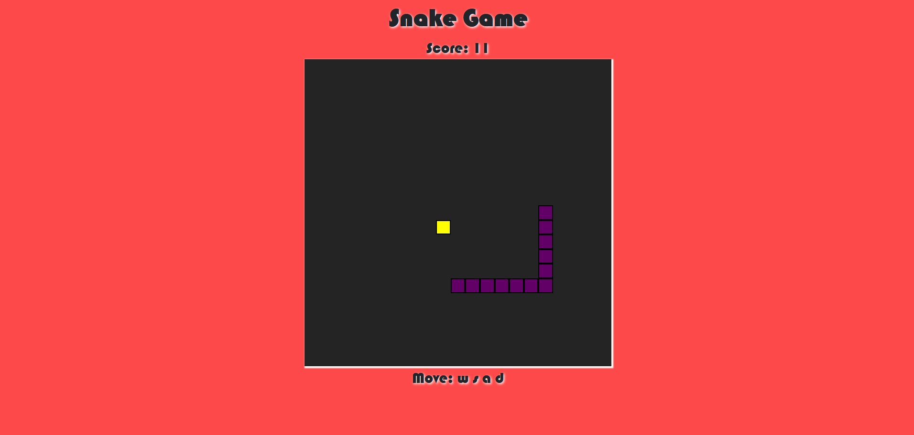

# Snake Game



A simple, classic browser based Snake Game implemented using JavaScript, Express, and HTML/CSS. Navigate the snake to eat food and grow, while avoiding the walls and your own tail. This version includes keyboard controls and a retro-inspired soundtrack.

Soundtrack available at: https://pixabay.com/music/video-games-retro-game-arcade-236133/

## Requirements
- Node.js

## How to play
1. Clone repository:
   ```bash
      git clone https://github.com/zephyrquest/snake-game.git
   ```
2. Move inside root folder:
   ```bash
      cd snake-game
   ```
3. Install the dependencies:
   ```bash
      npm install
   ```
4. Start the application:
   ```bash
      npm run start
   ```
5. Open the game in your browser:
    ```bash
    http://localhost:3000
    ```